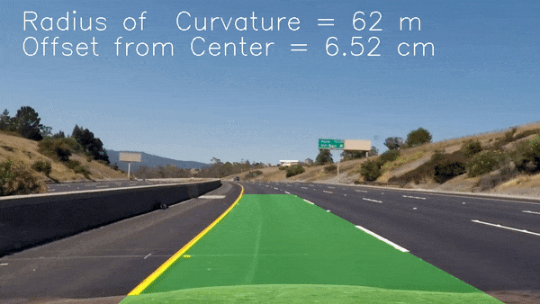

# Advance Lane Finding 

In this project I develop a pipeline for a video from a forward-facing car mounted camera resulting in a video that determines the lane lines, the location of the vehicle relative to the center and the radius of curvature.

software requirements:
 * python3
 * openCV
 * numpy

The completed pipeline can be executed using ``` python lanes_find.py``` from the command line.

Each component of the pipeline was encapsulted into their own classes.


  


## 1. Camera Calibration 

When a camera looks at 3D objects in the real world and transforms them into 2D images, a certain amount of information from the world gets distorted due to various factors such as lens curvature etc. We need to correct images taken from the camera by using a distortion matrix before information from the camera images can be used reliably.

A reliable way to calibrate the camera images is to use objects whose (x, y, z) coordinates with respect to the camera are known and correct for the same points on the camera images. To facilitate this idea we can use images of chessboard surfaces where the number of black/white box corners are known to be at a constant space from each other and the z coordinates lie on a flat plane.

The openCV library contains an utility function called ``` find_chessboard_images``` which can be used to determine the coordinates of the points on a given image of a chessboard.
The openCV library also contains an utility function called ```calibrateCamera``` which takes a set of image points and a set of object points and returns the distortion matrix along with other useful tranformation matrices.

I use the ```find_chessboard_images``` functions to determine the corners of chessboard images and generate object points which can be used to find the matrix.

This process is encapsulated in a class called ```Calibrator``` which is initialized in the beginning of the program and contains the undistort method which consistently undistorts images from the camera used to record the footage.

 

## 2. Binary Images

After correctly correcting the camera images for distortion we convert the color image into a binary image consisting of 0 and 1s. We want to do this in a way that the binary image always captures the lanes on the road regardless of changes in the surface quality and shadows created by sorrounding objects. I used a combination of 5 thresholding techniques:
* Sobel thresholding in Y direction
* Sobel thresholding in X direction
* Gradient magnitude 
* Gradient direction 
* Color thresholding on S channel in HSV colorspace

I encapsulated the process of making binary images into a class called ```ImageBinarizer``` which was then interactively updated to find the suitable parameters for each thresholding method.


 


 

## 3.  Perspective Transformation

After converting the images to binary form, I transform the image to get a birds eye view of the road to be able to see the lane lines from a top view so that they appear parallel to each other.

I applied the OpenCV functions ```getPerspectiveTransform``` and ```warpPerspective``` which take a matrix of four source points on the undistorted image and remaps them to four destination points on the warped image. 

The chosen region is then transformed using ```cv2.warpTransform``` so that the coordinates represent a rectangle. 


## 4. Lane Estimation

After the perspective transformation of the binary images are completed, we will identify the points of the image which represent a lane and then estimate polynomials which capture the line represented by the lane line. I took the bottom half of the image and found the histogram of the pixel values. Since the lanes were thresholded we find that the peaks of the histograms represent the position of pixels representing each lane.

I then create two lists for storing pixel indices representing the left lane and right lane. I populate this list by running a sliding window along the y axis for each lane starting at the position found by the histogram peaks and populate the indices lists with pixel positions representing each lane.

After determining which points represent each lane i estimate each lane polynomial by using the ```np.polyfit``` function. 

The two polynomials found are then used to estimate the real life curvature of the road along with how much the vehicle is offset from the center of the road. This is encapsulated into a class called LaneFinder which can be updated to change number of sliding windows and margins.

## 5. Completed Pipeline

After working with parameters in each of the steps of the pipeline, the completed image pipeline was encapsulated into a class called LaneDetector

This lane detector class is then used to process each frame of the project video and generate the video with lanes in each frame identified.

Here is the [final video output](https://youtu.be/1OXGJwN8yZM)

## Discussion

The technique works well in picking the yellow and white lanes. However, there are a few limitations:

1. The pipeline relies on the quality of binary images. And since the video was taken during the day, the model may not work well with inclement weather or at night.

2. The car was traveling on a flat road surface. The model probably will not work well if the road surface changes or if there is a lot of traffic or accident.

3. The algorithm does not take into consideration historical information from previous frames of the video which could be used to determine the confidence of the detection algorithm and generate a smoother output result.

